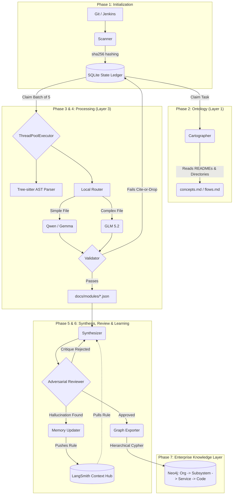

# Deep Repository Ontology Agent (DROA)
**Comprehensive Architecture & Deep Dive Guide**

---

## 1. Introduction: The Problem with RAG

When Enterprise organizations attempt to use standard Retrieval-Augmented Generation (RAG) to understand their massive codebases, they encounter three catastrophic failures:
1. **Semantic Drift**: A generic Vector DB chunks code arbitrarily. When an agent searches for "authentication", it gets a random chunk of a JWT library, completely lacking the context of *how* that library is wired into the application.
2. **Hallucinations**: When LLMs try to summarize thousands of lines of code, they often invent dependencies or architectural patterns that don't exist.
3. **The Monolith Problem**: You cannot fit a 5-million-line Java Monolith into a context window.

**The Solution:** DROA doesn't just embed code. It builds a **Repository Knowledge Base (RKB)**—a deterministic, highly-structured, 3-layer Enterprise Knowledge Graph. It reads code like a compiler, documents it like a Senior Engineer, and packages it for downstream Agentic AI.

---

## 2. The Three-Layer Abstraction Hierarchy

To solve the Context Window problem, DROA enforces a strict abstraction hierarchy. Downstream agents must read Layer 1 first. If they need more details, they read Layer 2, and finally Layer 3.

* **Layer 1: Ontology (The Map)**: High-level business concepts, directory structures, and system flows. 
* **Layer 2: Architecture (The Blueprints)**: Logical subsystems, data models, and cross-module dependencies.
* **Layer 3: Implementation (The Details)**: Deep, structural documentation of individual files.

---

## 3. System Architecture Diagram

DROA is orchestrated by a **LangGraph State Machine** backed by a robust **SQLite Ledger**.



---

## 4. Phase-by-Phase Deep Dive & Examples

### Phase 1: The Scanner & SQLite Ledger (Incremental Updates)
Instead of processing the whole repo every time, DROA computes a `sha256` hash of every file and stores it in `.rkb/state.db`. 
* **Handling Big Repos**: If you run DROA on a 10,000 file repository in your Jenkins CI/CD pipeline, and a developer only changed 2 files in their PR, the Scanner instantly skips 9,998 files. The LLM only processes the 2 modified files.

### Phase 2: Cartographer (Ontology)
The Cartographer agent builds Layer 1 without ever reading function implementations. It reads `CODEOWNERS`, `README.md`, and the directory structure to infer business logic.
* **Example Output**: `"Concept: Authentication Router. Owned by @security-team. Handles JWT validation before routing to the Database module."`

### Phase 3: Module Documenter & Universal Language Support
DROA is completely **Language Agnostic**. It uses **Tree-sitter**, the exact same C-based parsing engine used by GitHub, to dynamically extract the structural "skeleton" of a file before sending it to the LLM.

* **Example (Java vs Python)**: 
  Whether the file is a Java Spring Boot class or a Python FastAPI router, the Tree-sitter `ParserFactory` standardizes it into a JSON skeleton:
  ```json
  {
    "classes": ["AuthManager", "UserSession"],
    "functions": ["login", "validateToken"],
    "imports": ["java.util.List", "com.auth0.jwt"]
  }
  ```
  The LLM receives this exact JSON and is forced to document *only* these specific methods.

### Phase 4: The Validator (Hallucination Prevention)
To ensure absolute trust, DROA enforces the **Cite-or-Drop Rule**.
* **Example**: If the LLM generates documentation saying, *"The AuthManager connects to Redis for caching,"* but the AST parser did *not* find a Redis import or a caching function, the **Validator** catches the hallucination, rejects the JSON sidecar, and re-queues the task in SQLite to be tried again.

### Phase 4.5: Robust Parsing & Adaptive Error Logging
When connecting to enterprise proxies (e.g., local GLM proxies), transient network drops or markdown-heavy LLM responses (like Mermaid diagrams wrapped in code blocks) can corrupt outputs.
* **Outermost Bracket Parser (`llm_utils.py`)**: Instead of brittle regex that truncates on nested backticks, DROA scans for the outermost `{...}` boundaries to guarantee valid Pydantic JSON extraction, even if the model hallucinates formatting.
* **Adaptive Error Logging**: To prevent terminal bloat on 10,000-file repositories, standard processing is silent. Only when an LLM returns an empty payload or fails `model_validate_json` does the agent trigger a "heavy logging" text dump, isolating network timeouts vs. syntax errors instantly without disrupting the conductor loop.

### Phase 5: Auto-Healing, Adversarial Verification, & Continual Learning
When documenting massive codebases, dependency claims drift and LLMs hallucinate. 
* **Reciprocity Checking**: Module A claims it depends on Module B. But Module B doesn't acknowledge that Module A uses it. The deterministic `Reciprocity Checker` automatically loops back to the processing phase.
* **Adversarial Reviewer**: Once the Synthesizer generates the final architectural blueprints, a `Reviewer` agent attacks the document. If it finds unsupported claims, it generates a critique and rejects the document.
* **Continual Learning**: We don't just fix the mistake for one run. The `Memory Updater` agent reads the critique, extracts a general rule, and pushes it to **LangSmith Context Hub**. Every agent in DROA instantly pulls this rule on future runs, meaning the agent gets permanently smarter over time.

### Phase 6: The Enterprise Knowledge Layer (GraphRAG)
Finally, DROA packages the entire Knowledge Base for downstream AI Agents (like your CRM agent).
* **Enterprise Context**: By passing `--org`, `--subsystem`, and `--service` CLI flags, DROA embeds the repository into the wider business context.
* **Hierarchical Graph Structure**: It converts the data into a `load_graph.cypher` script, mapping `(:Organization)-[:CONTAINS]->(:Subsystem)-[:CONTAINS]->(:Service)-[:CONTAINS]->(:Module)-[:CONTAINS]->(:Symbol)`.
* **Hybrid Search**: It uses local `sentence-transformers` (e.g., `all-MiniLM-L6-v2`) to inject dense semantic vectors into the Neo4j nodes.
* **Result**: Downstream CRM agents can run Cypher queries to traverse the graph starting from the enterprise business unit all the way down to a specific line of code that threw an error.

---

## 5. How DROA Handles Massive Enterprise Repositories

Building an architecture that scales to millions of lines of code requires advanced engineering. DROA utilizes three major strategies:

1. **Massive Concurrency (`ThreadPoolExecutor`)**
   The LangGraph Conductor claims tasks from SQLite in batches. Because the DB uses a safe `BEGIN IMMEDIATE` transaction lock, the Python orchestrator spins up a `ThreadPoolExecutor` to execute the Module Documenter on 5-20 files concurrently, slashing processing time exponentially.

2. **Cost Optimization via Local Model Routing**
   Enterprises run local LLMs (vLLM, Ollama) to protect proprietary code. DROA implements a smart **Model Router**:
   - The Tree-sitter parser checks file complexity.
   - **Simple Files** (e.g., < 5 functions, < 200 lines): Routed to lightweight, lightning-fast models like **Qwen 2.5** or **Gemma**.
   - **Complex Files** (e.g., Core business logic, dense monolith classes): Routed to heavy reasoning models like **GLM 5.2**.
   - This maximizes token throughput on local GPUs while maintaining high quality.

3. **Incremental CI/CD Automation**
   As outlined in the `Jenkinsfile`, DROA is designed to be a completely hands-off daemon. Once integrated into Bitbucket/Jenkins, it wakes up on every PR merge, precisely updates the documentation for the changed lines of code, executes the Cypher script against the live Neo4j instance, and goes back to sleep.
