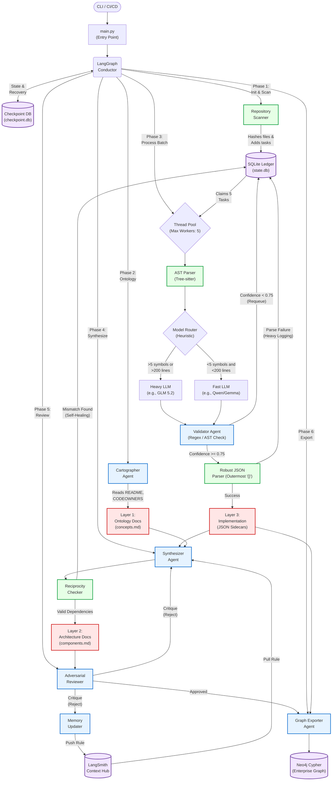

# Deep Repository Ontology Agent (DROA) Architecture

This diagram visualizes the flow of data, the different agents, and the layered architecture of the DROA system. The text in the diagram has been wrapped to avoid overflow, and the components have been granularized.



### Flow Breakdown & Technical Details

1. **The Orchestrator (`conductor.py`)**: 
   - Uses `LangGraph` to manage the state machine (`init` -> `scan` -> `process` -> `synthesize`).
   - Uses `langgraph.checkpoint.sqlite.SqliteSaver` to persist the state machine phase in `checkpoint.db`. This allows the agent to resume exact execution if killed.
2. **The Ledger (`db.py`)**: 
   - A deterministic SQLite database (`state.db`) with a `tasks` table.
   - The scanner computes `sha256` hashes of file contents. If a hash matches the last run, the file is skipped (incremental updates). 
   - Uses transactions (`BEGIN IMMEDIATE`) to safely claim tasks in a multi-threaded environment.
3. **The Workers (Phase 3)**:
   - **Concurrency**: `ThreadPoolExecutor` spawns 5 concurrent threads to process 5 files simultaneously.
   - **AST Parsing**: Tree-sitter runs locally on the machine to parse Python/Java/Go files and build a dictionary of `classes`, `functions`, and `imports`.
   - **Routing**: `module_documenter.py` evaluates the AST output. Large/complex files are routed to a more capable LLM, while simple files are routed to a faster/cheaper LLM. Both return strict `ModuleSidecar` Pydantic models via Langchain structured outputs.
   - **Validation (`validator.py`)**: A deterministic script checks the LLM's output. It verifies that citations `[file:line]` resolve to actual files and lines, and checks API coverage against the Tree-sitter skeleton.
4. **Adversarial Verification & Continual Learning (Phase 5)**:
   - **Reviewer**: Evaluates the synthesized architectural documents to catch hallucinations. If flaws are found, it rejects the document and generates a detailed critique.
   - **Memory Updater**: Analyzes the critique to extract a generalized rule and pushes it to **LangSmith Context Hub**. This updates the permanent agent prompt for all future runs, creating a self-improving system.
5. **Enterprise Knowledge Layer (Phase 6)**:
   - `graph_exporter.py` takes CLI flags (`--org`, `--subsystem`, `--service`) and structures the extracted repository into a unified Neo4j hierarchical graph, linking modules directly to organizational services.

---

## Configuration & Setup Guide

If you are going to run this locally, here is what you need to configure:

### 1. LLM API Keys and URLs
DROA uses a mix of models. It uses local/open-source models for massive parallel file processing (to save money and data privacy), and Google Gemini for high-level synthesis and ontology tasks.

**For the Local/Open-Source Models (Phase 3: Module Documenter):**
The code in `module_documenter.py` routes to a local OpenAI-compatible endpoint (like vLLM, Ollama, or LM Studio). You must set these environment variables before running the script:
```bash
export LOCAL_LLM_BASE_URL="http://localhost:8000/v1" # Your local LLM server URL
export LOCAL_LLM_API_KEY="dummy"                     # Often "dummy" or "sk-xxx" for local servers
```
*Note: In `module_documenter.py`, the heavy model is hardcoded as `"glm-4"` and the fast model as `"qwen-2.5"`. If your local server uses different model names (e.g., `llama-3-8b`), you will need to change those strings on lines 29 and 37 of `src/deep_rkb_agent/agents/module_documenter.py`.*

**For the Google Gemini Models (Phase 2 & 4: Cartographer & Synthesizer):**
The `cartographer.py` and `synthesizer.py` agents use `gemini-2.5-pro` via `ChatGoogleGenerativeAI`. You must set your Google API key:
```bash
export GOOGLE_API_KEY="AIzaSyYourGoogleApiKeyHere"
```

### 2. Thread Pool Configuration (Concurrency)
By default, the agent runs 5 parallel threads. If you have a powerful machine (e.g., a large Mac Studio or a server running vLLM that can handle many concurrent requests), you can speed up the repository processing.

To change this, open `src/deep_rkb_agent/conductor.py` and modify lines 83, 88, and 89:
```python
# Change limit=5 to your desired batch size (e.g., limit=10)
tasks = claim_next_batch(state["repo_root"], limit=10) 

# Change max_workers=5 to match your batch size
with ThreadPoolExecutor(max_workers=10) as executor: 
```
*Warning: Do not increase this beyond what your local LLM server can handle simultaneously, otherwise requests will timeout.*

### 3. Graph Embedding Model
In `graph_exporter.py`, the agent tries to use `sentence_transformers` to create vector embeddings for GraphRAG. It downloads the `all-MiniLM-L6-v2` model automatically. 
If you want to run this, you must install the pip package:
```bash
pip install sentence-transformers
```
If you don't install it, the agent will gracefully skip the embedding step and just output standard Neo4j nodes.
